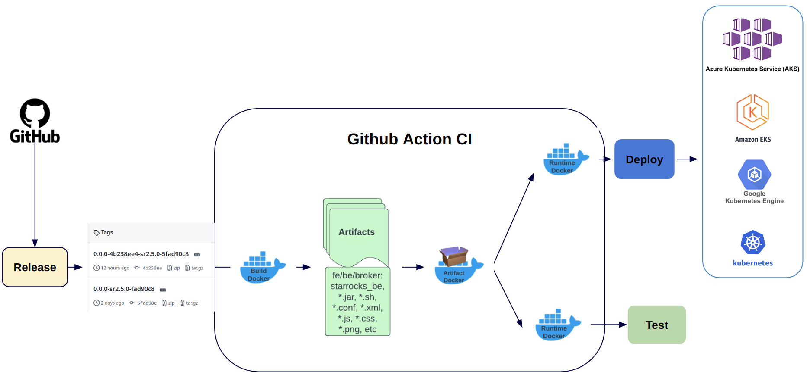
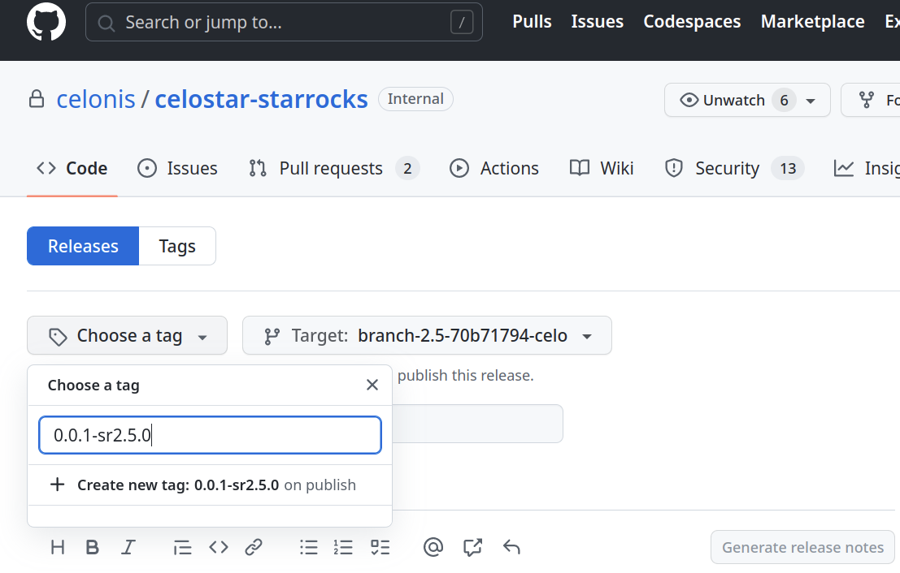
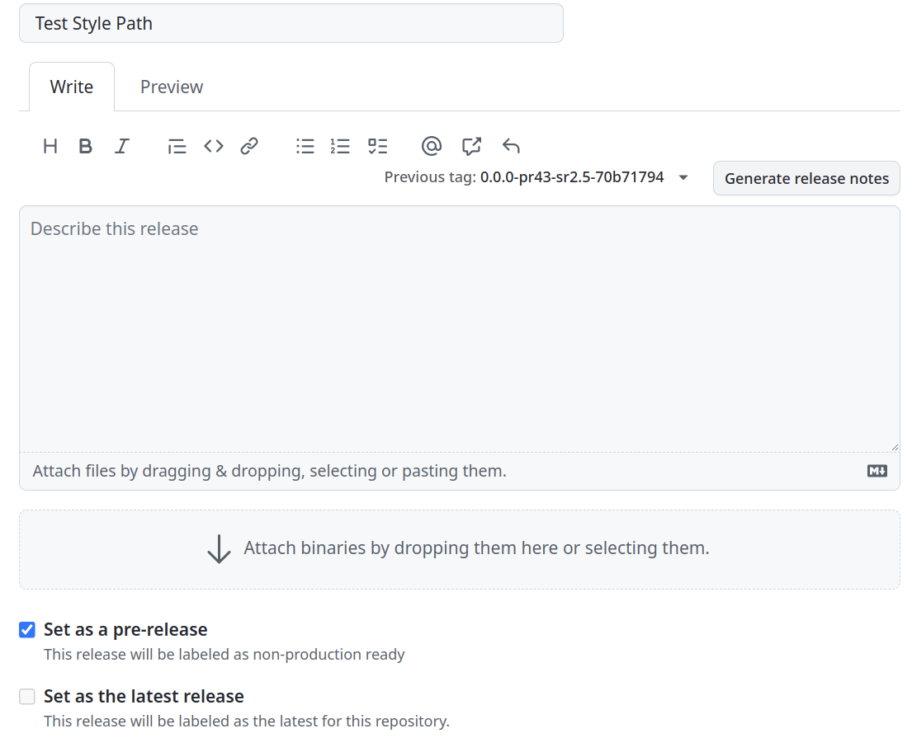
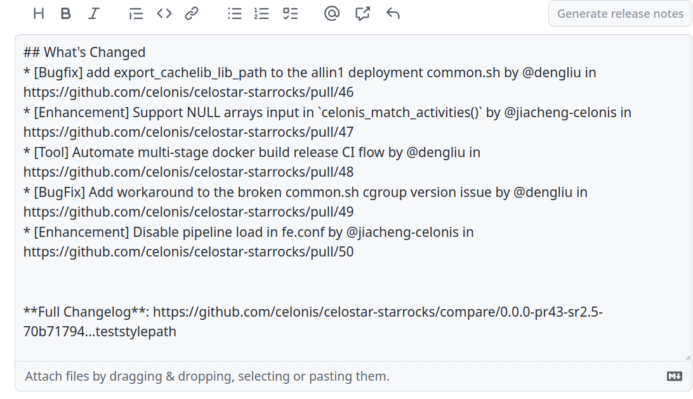
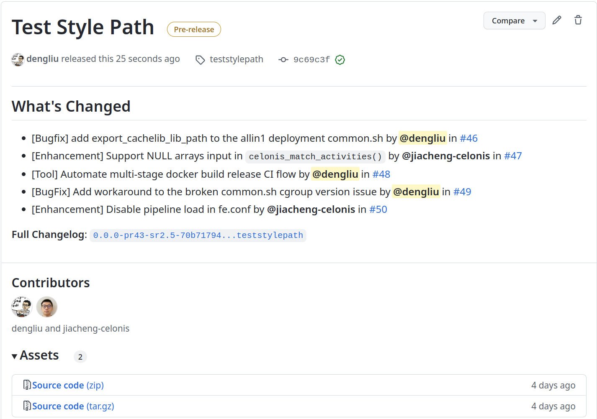
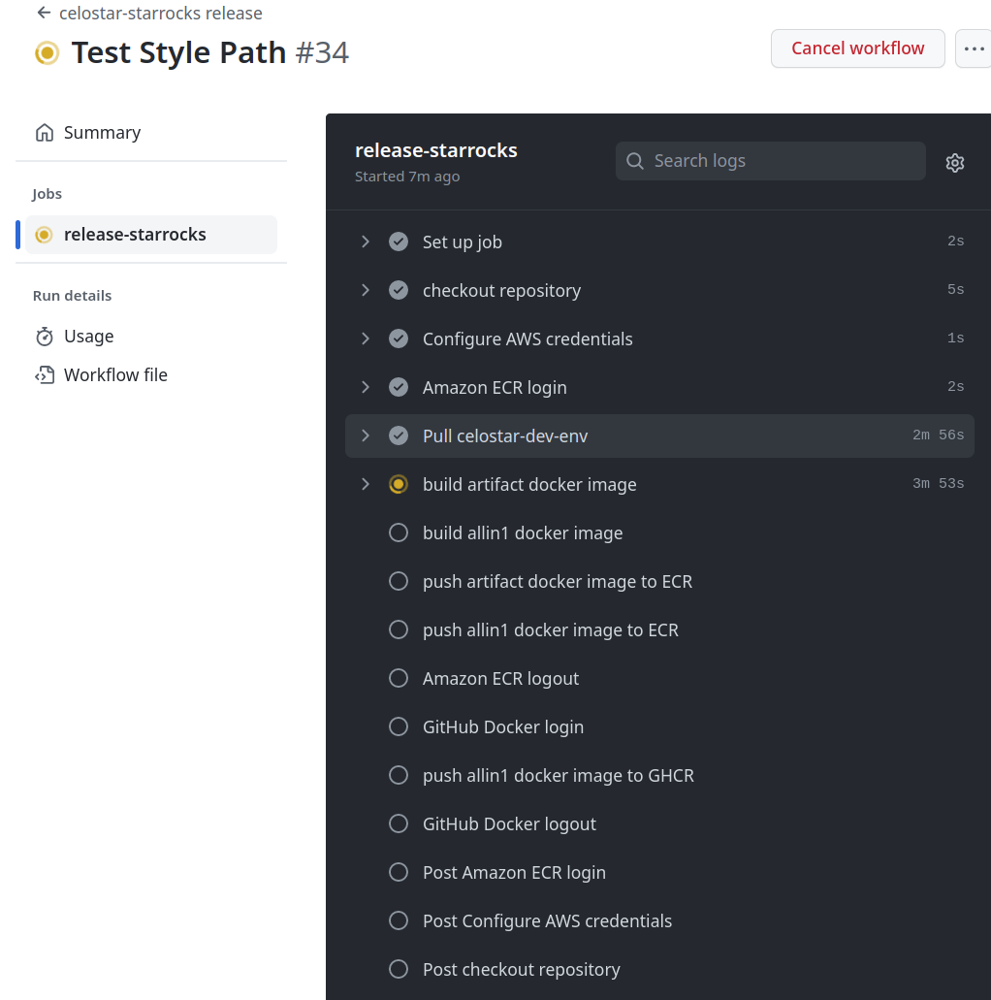

# Celonis Starrocks Fork Repo Development and Release Guide

## Life Cycle of a release
A change will go through the follow steps to make into a docker image.
As of today, we have implemented Github CI workflow to automatically build the code into artifacts and package artifacts into runtime container image. (We are also in the process of automating the CD with Kubernetes operator and Argo CD. Will update this doc later.)
1. Commit changes to the repo
2. Tag a release
3. Build Docker Images
4. Deployment



### How to contribute commit to the repo
We should follow up the standard [Github flow](https://docs.github.com/en/get-started/quickstart/github-flow) to contribute:
1. Create a branch from the default branch of the repo.  (**Note**: the default branch is neither main nor master branch, and it could change when there is upstream version upgrade.)
2. Make changes
3. Create a pull request
4. Address review comments
5. Merge your pull request 
6. Delete your local feature branch. (**Note**: the repo is already setup to automatically delete the remote feature branch after PR is merged. One only needs to delete local feature branch.)

### Tag a release
**1. Go to the [celostar-starrocks repo release page](https://github.com/celonis/celostar-starrocks/releases)**

**2. Draft a release**



A release can be drafted from the default branch for an official release or from any feature branch for a test release. A release tag is needed to draft the release (**Note:** When drafting for test release, please check `Set as a pre-release`)



Technically we can put anything into the release notes. For official release, it is recommended to generated a release note with respect to the previous tag. So it can automatically generate the change logs as below:



A complete release page will be look like this below:



### Build Starrocks docker image
As soon as a release (either production release or test release) is published, a Github action workflow job will be kicked off to build the correcponding version with the starrocks artifacts and docker images. The workflow job will retult a few docker images being built and push to AWS ECR and Github GHCR. **The image tag is a 1:1 mapping to release tag in the git repo.**

The images built in ECR will be used for deploying to EKS. The images in GHCR will be used for running by [Testcontainers](https://www.testcontainers.org/) for integration test.

(**Note**: Please NEVER deploy a test release image to EKS)

```
* ghcr.io/celonis/docker-registry/celostar-starrocks:0.0.0-pr50-sr2.5-70b71794_cg2
* 904263465335.dkr.ecr.us-west-1.amazonaws.com/starrocks-allin1:0.0.0-pr50-sr2.5-70b71794
* 904263465335.dkr.ecr.us-west-1.amazonaws.com/starrocks-allin1:0.0.0-pr50-sr2.5-70b71794_cg2
* 904263465335.dkr.ecr.us-west-1.amazonaws.com/starrocks-artifacts:0.0.0-pr50-sr2.5-70b71794
```


### How to rebase Celonis internal commits to a new upstream stable version?
Please refer to [here](./rebase_upstream.md).

### How to build a Starrock docker image locally?
Please refer to [Normalize Starrocks development, test and deployment workflow with multi-stage docker build
](https://docs.google.com/document/d/17HLjAOU9DDpu9wG4Rd4sxYjpctVHn79rcJfG_ZiZWjY/edit#)

## Where to get more details of how the release and build work?
* [Normalize Starrocks development, test and deployment workflow with multi-stage docker build
](https://docs.google.com/document/d/17HLjAOU9DDpu9wG4Rd4sxYjpctVHn79rcJfG_ZiZWjY/edit#)
* [Celostar-Starocks Fork Repo Contribution and Release Guideline](https://docs.google.com/document/d/1Vj0Z6-zHYcNC8knGJCZkyZULnx5mo9wCoCXYMz5kXTc/edit#)
