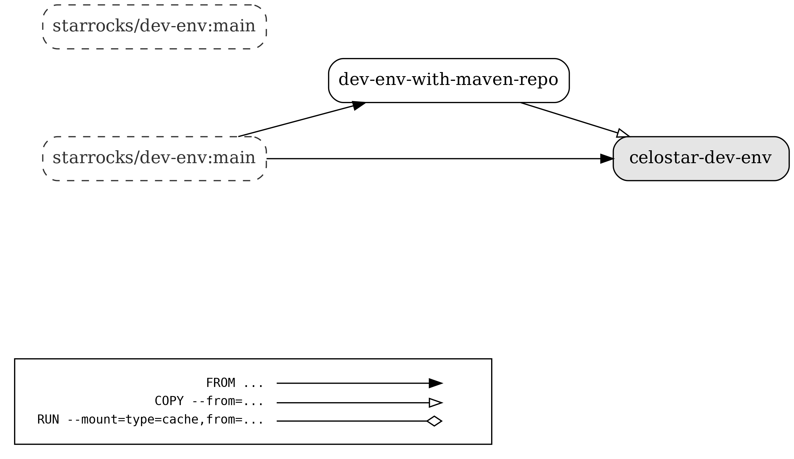

# Docker file for building a celostar-starrocks dev docker

## Improvement to the official starrocks/dev-env
* Enabled SSH for Intellij Remote development
* Pre-downloaded the Maven dependence repositories to speed up fe and broker built
* Retain environment variable in SSH session
* Update git to the latest version and install a few more tools

## Multistage Docker build graph

