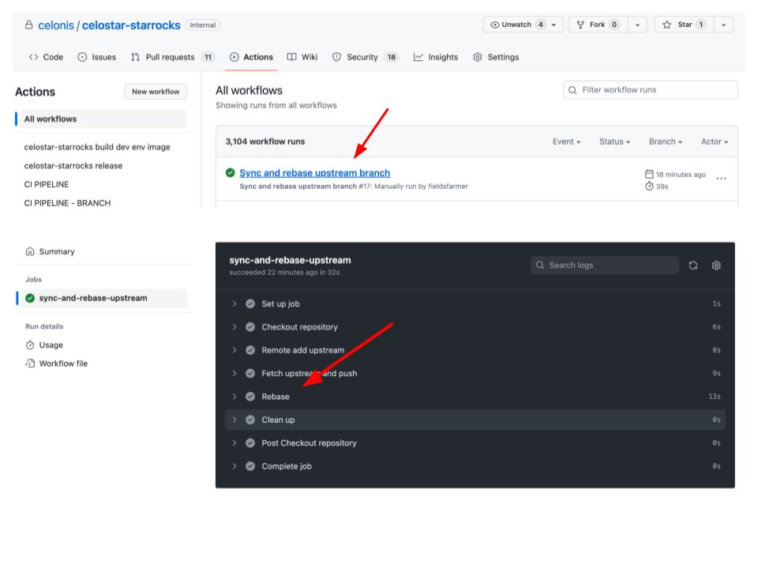
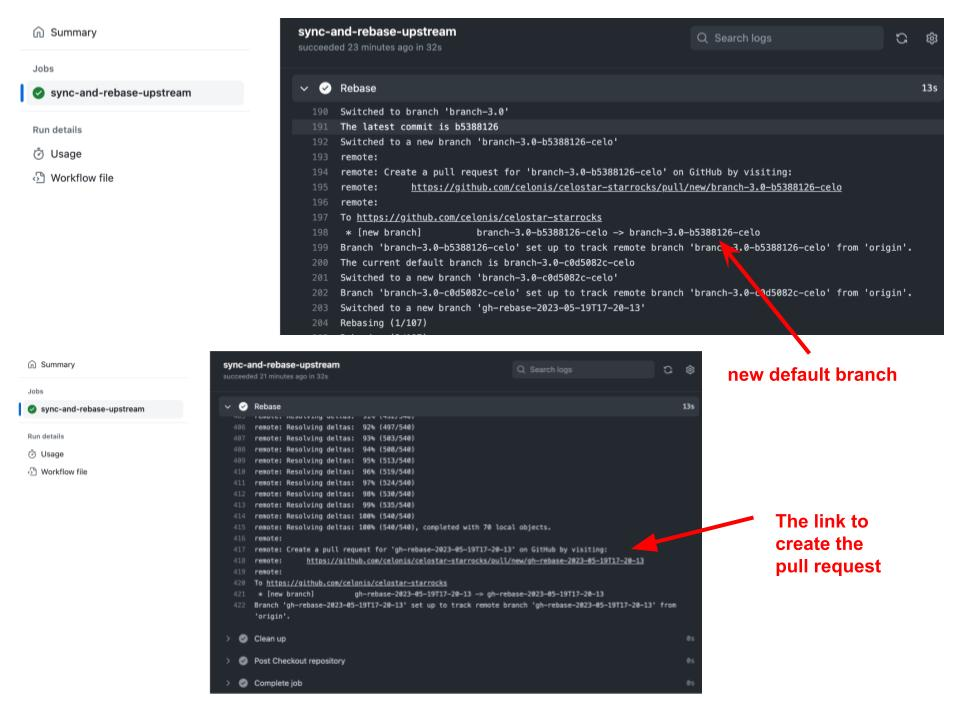

### Rebase Celonis internal commits to a new upstream stable version
1. Launch the workflow of "Sync and rebase upstream branch". There are two ways to do this.
     - Either you could launch it from the GitHub web page by following [this instruction](https://docs.github.com/en/actions/managing-workflow-runs/manually-running-a-workflow).
     - Or you could launch it from the terminal within the local repo directory:
```
<path_to_the_repo>/celostar-starrocks$ gh workflow run celonis_sync_and_rebase_upstream.yml
```

2. Find the workflow link in the GitHub repo's "Actions" menu and click it to see its steps.



3. Find the new default branch and the link to create the pull request in the step of "Rebase".



4. Click the last link and it will direct you to a web page to create the pull request. Remember to change the merge 
branch to the new default branch from step 3.


For more details, please refer to the details in [this doc](https://docs.google.com/document/d/1Vj0Z6-zHYcNC8knGJCZkyZULnx5mo9wCoCXYMz5kXTc/edit#heading=h.e1yprybzha3v).