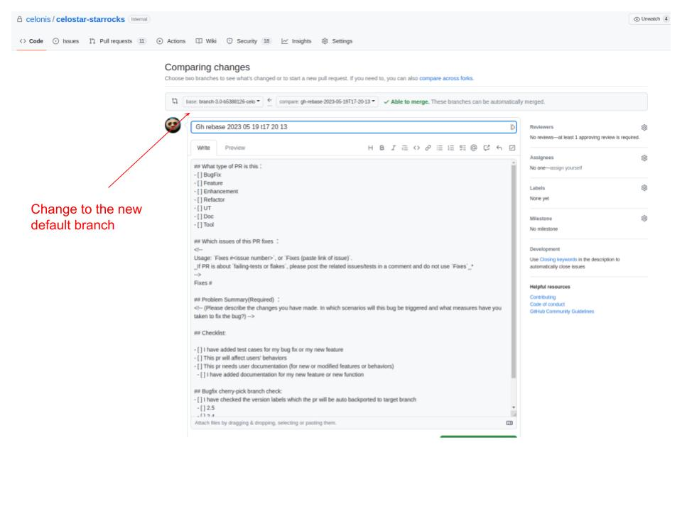

### Rebase Celonis internal commits to a new upstream stable version
For fastlane-aware, distributed rebases, follow [the fastlane rebase guide](./fastlane_rebase.md). The workflow below
remains available for the legacy rebase and ad-hoc branch-test path.

1. Launch the workflow of "Sync and rebase upstream branch". There are two ways to do this.
     - Either you could launch it from the GitHub web page by following [this instruction](https://docs.github.com/en/actions/managing-workflow-runs/manually-running-a-workflow).
     - Or you could launch it from the terminal within the local repo directory:
```
<path_to_the_repo>/celostar-starrocks$ gh workflow run celonis_sync_and_rebase_upstream.yml
```

2. After the run, it will generate a GitHub issue based on the result.
   * If the run fails, the issue will only contain the run link.
   * If the run succeeds, in the issue, it will tell about the new default branch and the link which will direct you to
     a web page to create the pull request. See [this example](https://github.com/celonis/celostar-starrocks/issues/249).
     Remember to change the merge branch to the new default branch.
     
     After presubmit succeeds, remember to click "**Rebase and merge**" button to submit so that it will keep the history.
     If using "Squash and merge", we will lose the history.

For more details, please refer to the details in [this doc](https://docs.google.com/document/d/1Vj0Z6-zHYcNC8knGJCZkyZULnx5mo9wCoCXYMz5kXTc/edit#heading=h.e1yprybzha3v).
